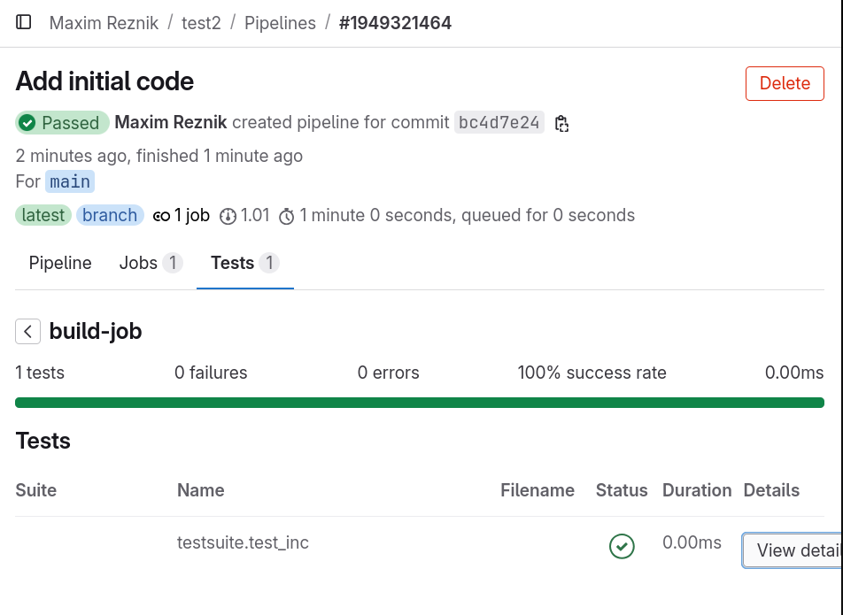

# GitLab integration

Gitlab CI can import test information using XML format.
Here's how to do it. For example, let's create a primitive library
and tests for it on trendy_test:

```shell
alr init --in-place --lib test2
cd test2
alr init --bin testsuite
cd testsuite
alr with test2 --use=..
alr with trendy_test --use=https://github.com/pyjarrett/trendy_test
```

Let's add a simple function that we will test later:
```ada
package Test2 is

   function Inc (Value : Integer) return Integer is
     (Value + 1);

end Test2;
```

The simplest test might look like this:
```ada
with Test2;

with Trendy_Test;
with Trendy_Test.XML_Reports;

procedure Testsuite is
   
   procedure Test_Inc (T : in out Trendy_Test.Operation'Class) is
   begin
      T.Register;  -- Don't put anything above here
      
      Trendy_Test.Assert
        (T, Condition => Test2.Inc (2) = 3);
   end Test_Inc;
   
   My_Tests : constant Trendy_Test.Test_Group :=
     (1 => Test_Inc'Unrestricted_Access);
begin
   Trendy_Test.Register (My_Tests);

   Trendy_Test.XML_Reports.Print_XML_Report
     (File_Name => "junit.xml",
      Results   => Trendy_Test.Run);
end Testsuite;
```

After running such a test, it leaves an XML report `junit.xml` in the current directory.

Let's create a GitLab CI description file `.gitlab-ci.yml`:

```yaml
default:
  image: ubuntu:22.04
build-job:
  stage: build
  script:
    - ./.ci-script.sh

  artifacts:
    when: always
    paths:
      - testsuite/junit.xml
    reports:
      junit: testsuite/junit.xml
```

And the bash script itself `.ci-script.sh`:

```shell
#!/bin/sh
apt-get update -y
apt-get install -y curl zip git libc6-dev
curl -L -O https://github.com/alire-project/alire/releases/download/v2.1.0/alr-2.1.0-bin-x86_64-linux.zip
unzip alr*.zip
PATH=$PWD/bin:$PATH
alr toolchain --select gprbuild^25 gnat_native^15
alr -C testsuite run
```

Having added all this to the gitlab repository, we will see the tests
on the **Tests** tab in **Pipelines**:



Repository with example: [gitlab.com/reznikmm/test2](https://gitlab.com/reznikmm/test2)
